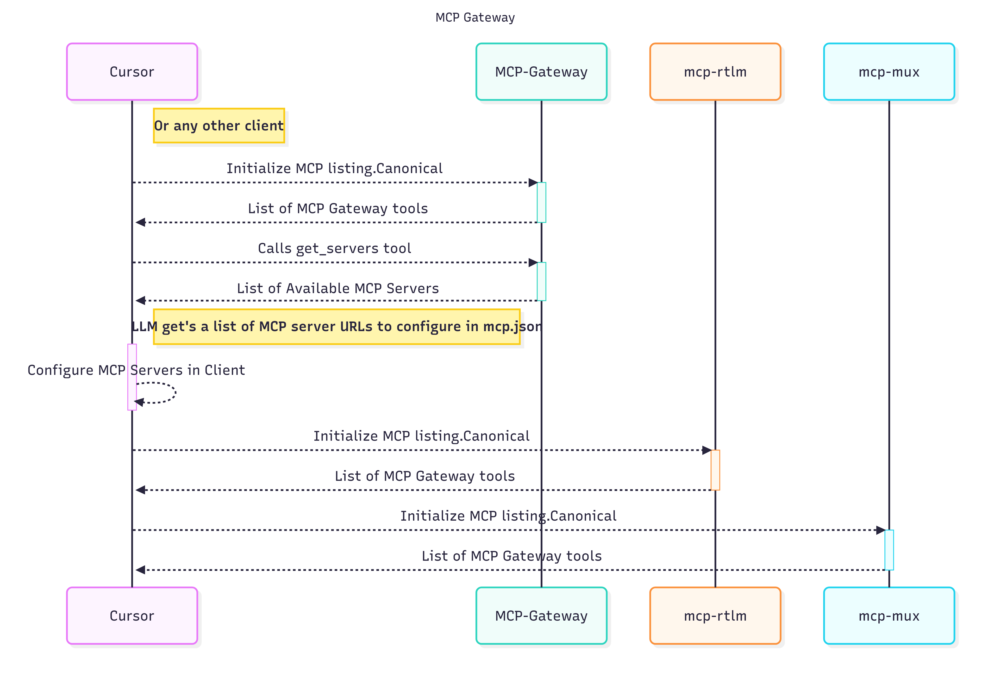

# MCP Gateway 

The **MCP Gateway** is a central registry point for MCP clients (e.g. *Slack MCP client*, *Cursor*, etc.).
It discovers MCP servers dynamically inside Kubernetes clusters and exposes a standard MCP interface so clients can list and access those servers.

The registry solves three main problems:

1. **Dynamic discovery** – Any new MCP-enabled service added to the cluster is automatically registered and made visible.
2. **Central access point** – Clients (Slack, CLI, etc.) only need to connect to the gateway, not each service directly.
3. **RBAC control** – To be implemented: Currently it has `NoOpProvider` which allows all access by default.


## Architecture





* **MCP Clients** – Slack MCP client, CLI tools, or any MCP-compliant consumer.
* **MCP Gateway Registry** – This project. Runs in Kubernetes, exposes `/mcp` over HTTP.
* **MCP Servers** – Services running in the cluster with the label `mcp-server=enabled` and appropriate annotations.


## Service Discovery

Discovery is implemented in [`internal/discovery/k8s.go`](internal/discovery/k8s.go) using Kubernetes informers.

* Watches `Services` in a namespace (`mcp-services` by default).
* Matches only services with label selector:

  ```yaml
  labels:
    mcp-server: enabled
  ```
* Extracts **ID**, **Prefix**, and **Address** from annotations (preferred) or falls back to service metadata.

  ```yaml
  annotations:
    mcp.gateway/id: "mcp-mux"
    mcp.gateway/prefix: "mcp-mux"
    mcp.gateway/address: "http://mcp-mux-testserver.mcp-services.svc.cluster.local:8081/mcp"
  ```

When a service is added/updated/removed, the gateway updates its in-memory server list automatically.


## Registry

[`internal/registry/registry.go`](internal/registry/registry.go) manages discovered servers:

* Periodically refreshes the cache (defaults: 30s refresh, 5m cache).
* Provides RBAC-filtered access via the `rbac.Provider` interface.
* Serves as the backend for the MCP resource `mcp://registry/servers`.


## RBAC

Currently implemented as [`internal/rbac/provider.go`](internal/rbac/provider.go):

* Default provider is `NoOpProvider` – all users see all servers.
* In production, this will be replaced with a Fox credential-aware provider (e.g. JWT, OAuth2, or SSO integration).
* Goal: restrict server visibility based on user identity and project scope.


### MCP Server Resource

The registry itself is an MCP server, exposing the resource:

```
URI: mcp://registry/servers
MIME: application/json
```

Response example:

```json
{
  "mcpServers": {
    "mcp-mux": {
      "url": "http://mcp-mux-testserver.mcp-services.svc.cluster.local:8081/mcp"
    }
  }
}
```

This resource is queried by MCP clients (Slack, CLI) to fetch the list of available servers.


## Configuration

Configuration is loaded from `config.yaml` (or via `MCP_GATEWAY_CONFIG` env var).

### Example

```yaml
gateway:
  name: "mcp-gateway"
  version: "1.0.0"
  environment: "kubernetes"

kubernetes:
  namespace: "mcp-services"
  label_selector: "mcp-server=enabled"
  poll_interval: "30s"
  in_cluster: true

transport:
  mode: "http"
  addr: ":8081"

health:
  port: 8086
```


## Deployment

### Build and Load into Minikube

```bash
docker build -t mcp-gateway:dev .
minikube image load mcp-gateway:dev
```

### Apply Kubernetes Manifests

```bash
kubectl apply -f k8s/k8s-manifests.yaml
kubectl get pods -n mcp-services -w
```

### View Logs

```bash
kubectl logs -n mcp-services deploy/mcp-gateway -f
```

You should see discovery events:

```
{"level":"INFO","msg":"discovered new MCP server","server_id":"mcp-mux"}
```


## Testing

Forward the MCP gateway port:

```bash
kubectl port-forward -n mcp-services svc/mcp-gateway 8081:8081
```

Query the registry resource:

```bash
curl -sS -X POST http://localhost:8081/mcp \
  -H "Content-Type: application/json" \
  -d '{"jsonrpc":"2.0","id":1,"method":"resources/read","params":{"uri":"mcp://registry/servers"}}' | jq .
```

Expected:

```json
{
  "mcpServers": {
    "mcp-mux": {
      "url": "http://mcp-mux-testserver.mcp-services.svc.cluster.local:8081/mcp"
    }
  }
}
```

## Development Notes

* Uses `k8s.io/client-go` informers for event-driven service discovery.
* Uses `mark3labs/mcp-go` to implement MCP server resources.
* Registry runs as a standard HTTP server (`/mcp` POST endpoint).
* Health endpoints:

  * `/healthz` – liveness
  * `/readyz` – readiness


## Roadmap

* [ ] Replace `NoOpProvider` with proper Fox credential-based RBAC.
* [ ] Add full JSON-RPC 2.0 support (not just `resources/read`).
* [ ] Add metrics endpoints.
* [ ] Extend discovery to support cross-namespace visibility if required.
